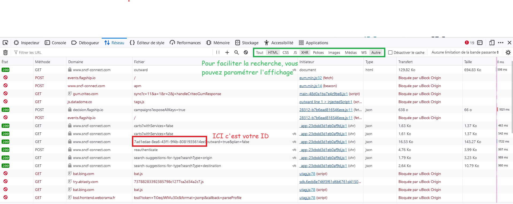

Edit : ça marche plus, à réparer un jour.

Fini de F5 comme un degen pour réussir à obtenir un billet pour un train complet.

## How to

* Faites votre recherche 1 fois sur le site sncf-connect
* Ouvrez la console développeur avec F12, allez dans l'onglet réseau
* Actualisez la page (F5)
* Dans les requêtes qui s'affichent dans votre onglet réseau, repérer la requête qui contient l'ID de votre recherche :

* copiez l'ID de la requête dans le paramètre "request_id" du notebook
* exécutez le notebook

Votre recherche est ainsi relancée toutes les minutes. "True" signifie qu'une place est disponible, "False" signifie que le train est toujours complet. A vous de surveiller la sortie et de retourner sur sncf-connect dès que le train qui vous intéresse se libère.
